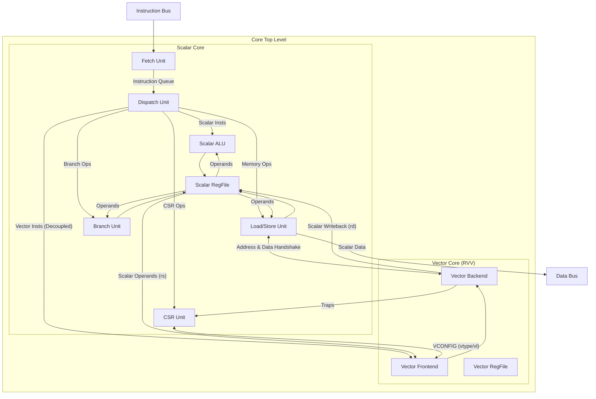

# Scalar Core Architecture Extraction and Analysis

This document provides a detailed analysis of the Scalar Core architecture within the `coralnpu` project. The Scalar Core is a high-performance, configurable RISC-V processor designed to operate as a standalone unit or as a scalar driver for a companion Vector Core (RVV).

## 1. Architectural Overview

The Scalar Core (`SCore`) is implemented in Chisel and features a multi-lane fetch and dispatch pipeline (configurable via `instructionLanes`). It follows a decoupled architecture where the frontend (Fetch) feeds a central Dispatch unit, which then issues instructions to various specialized execution units.

### Key Characteristics:
-   **ISA Support**: RISC-V 32-bit (RV32IM), with optional Floating-Point (RV32F) and Vector (RVV) extensions.
-   **Pipeline**: Decoupled Fetch-Dispatch-Execute structure.
-   **Multi-issue**: Capable of dispatching multiple instructions per cycle (superscalar) if lanes > 1.
-   **Vector Integration**: Tightly coupled with `RvvCore` for handling vector instructions.

## 2. High-Level Block Diagram

## 3. Detailed Component Analysis

### 3.1 Fetch Unit (`Fetch.scala`)
The Fetch unit is responsible for retrieving instructions from memory.
-   **L0 Cache**: It includes an integrated L0 instruction cache to reduce latency.
-   **Branch Prediction**: Implements a partial decoder to identify branches early. It uses a static prediction scheme: backwards branches are assumed taken, forward branches are assumed not taken.
-   **Interface**: Delivers aligned instruction blocks to the Dispatch unit.

### 3.2 Dispatch Unit (`Dispatch.scala`, `Decode.scala`)
The Dispatch unit (`DispatchV2`) is the brain of the core. It handles decoding, dependency checking, and instruction issuance.
-   **Decoding**: Converts raw instruction bits into internal control signals (`DecodedInstruction`).
-   **Scoreboarding**: Maintains a scoreboard to track register writes and prevent Read-After-Write (RAW) and Write-After-Write (WAW) hazards.
-   **Hazard Handling**:
    -   **Structural Hazards**: Checks if execution units (like LSU queue) have space.
    -   **Control Hazards**: Flushes the pipeline on mispredicted branches.
-   **Vector Interlocks**: Manages configuration state (`vsetvli`) and ensures vector store buffers are synchronized.
-   **Issue Logic**: Uses a "Try-Dispatch" loop to greedily issue instructions to available functional units.

### 3.3 Load/Store Unit (`Lsu.scala`)
The LSU handles all memory traffic for both scalar and vector operations.
-   **Scalar Access**: Supports standard byte, half-word, and word accesses.
-   **Vector Access**: Handles complex vector addressing modes including:
    -   Unit-stride
    -   Strided
    -   Indexed (Gather/Scatter)
-   **Alignment**: Manages data alignment for sub-word accesses.
-   **Store Buffer**: Manages pending stores and writebacks.

### 3.4 Execution Units
-   **ALU (`Alu.scala`)**: Performs standard integer arithmetic and logic operations. One ALU exists per instruction lane.
-   **Branch Unit (BRU) (`Bru.scala`)**: Resolves branch conditions and computes jump targets. Only one BRU manages the program counter changes, but multiple can exist for calculation.
-   **Multiplier (MLU) & Divider (DVU)**: Handle integer multiplication and division operations.

### 3.5 Register File (`Regfile.scala`)
-   **Structure**: A multi-ported register file supporting the RV32I base integer registers.
-   **Ports**: Configured based on the number of issue lanes to support simultaneous reads and writes from multiple units.
-   **Forwarding**: Works in tandem with the Dispatch scoreboard to handle data forwarding where applicable.

### 3.6 Floating Point Unit (Optional)
-   **FRegfile**: Separate register file for floating-point registers (`f0`-`f31`).
-   **FloatCore**: Wraps the FP execution logic.
-   **Integration**: The Dispatch unit handles FS status tracking and scoreboard for FP registers similar to GPRs.

## 4. Vector Core Integration
The construction of `SCore` explicitly supports an external `rvvcore`.
-   **Instruction Keep-alive**: Vector instructions are decoded in the scalar core and passed to the vector core.
-   **LSU Coupling**: The Scalar LSU handles address generation for vector loads/stores, while the data payload transfer is coordinated with the Vector Core.
-   **Synchronization**: The Dispatch unit enforces `vstart` and configuration validity checks before issuing vector instructions.

## 5. Control Flow & Exception Handling
-   **Fault Manager**: Aggregates fault signals from Fetch, Decode, and Execution units (e.g., illegal instruction, misaligned access).
-   **CSRs**: The `Csr` module maintains the processor status (MSTATUS, MEPC, MCAUSE) and handles interrupt enabling/disabling.
-   **Debug**: Includes a Debug Module (DM) interface for external debugging control (halt, resume, single-step).

## Conclusion
The `coralnpu` Scalar Core is a sophisticated design that balances scalar performance with robust support for vector acceleration. Its decoupled and modular nature allows for scalable performance tuning via lane configuration.
